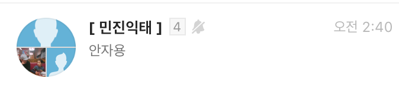

# LinearLayout
포함된 뷰를 순서대로 가로나 세로 방향으로 나열한다.   
따라서, 다른 layout에는 없는 순서를 결정하는 orientation 속성이 있다.

## 레이아웃 중첩
ListView의 Adpater: 카카오톡 채팅 목록을 작성한다고 가정.


- ImageView: 프로필 사진
- TextView: 이름, 내용, 날짜

### Key-Point
- 이름과 내용이 위아래로 나열되었다는 점이다.
- LinearLayout 안에 LinearLayout을 넣어서 개발한다.
- 결과
```xml
<LinearLayout>
    <TextView/>
    <TextView/>
    <LinearLayout>
        <TextView/>
        <TextView/>
    </LinearLayout/>
<LinearLayout/>
```

1. gravity: 안의 내용물, 뷰의 내용을 뷰 영역 안에서 어디에 나타낼지 설정

2. layout_gravity: 해당 layout을 전체 뷰의 어디에 나타낼지, 뷰를 LinearLayout 내에서 어디에 나타낼지 설정.

3. LinearLayout은 방향을 나타내는 orientation이 존재하는데, 따라서 orientation에 따라 center_vertical, center_horizontal이 적용안된다. --> 문제를 해결하기 위해 gravity를 사용한다.

4. weight: 상대적 수치
모든 weight 값을 더해서 등분으로 계산한다.